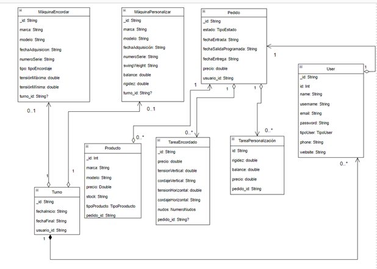

# TENIS LAB BARCELONA

## Problema Propuesto
La vida te hace conocer a personas extraordinarias. Xavi Colomina es uno de los mejores encordadores y técnico para personalizar raquetas que hay. Él trabaja con figuras ATP y WTA. Además de magnifico profesional, es una persona maravillosa. Y me siento orgulloso de poder llamarlo amigo. “Colo”, me hizo mis raquetas hace un tiempo (uno de mis tesoros personales), y aún tenemos otras pendientes (no se puede escapar de ello). Un día me dijo: “Me gustaría tener una app para gestionar los pedidos que tenemos en el torneo de Conde de Godó”.
Cuando hay un pacto entre buena gente hay que cumplirlo. Así que vamos a esbozar con el nivel que tenemos en este curso una pequeña aplicación para gestionar los encordados. ¿Nos ayudas a Colo y a mi y te sacas una buena nota?
En nuestra aplicación se conectan distintos usuarios, con su nombre, apellido, email y password (siempre codificado en la base de datos, usando sha512). Además, sabemos que existe el perfil de administrador (encargado o jefe), encordador (trabajador) y tenista (cliente).

Trabajamos con varias máquinas, que son de encordar o de personalización. Para cada máquina, nos interesa saber su marca, modelo, fecha de adquisición y número de serie. Si la máquina es de encordar, debemos saber si es manual o automática, tensión máxima y tensión mínima de trabajo. Si es de personalizar, debemos saber si puede o no medir maniobrabilidad (swingweight), balance (equilibrio) y rigidez (resilencia).

Los pedidos pueden estar formados por varias tareas o partes de trabajo a realizar que recibimos de un tenista y son asignados a un encordador y tiene un estado: recibido, en proceso o terminado y la máquina asociada si se necesita. Tenemos un tope de entrega marcado por una fecha. Los pedidos tiene una fecha de entrada, una fecha de salida programada y de salida final y un precio asociado que es la suma de todas las acciones. La fecha de salida final será inicialmente la programada, luego se actualizará a la real. 

Para cada tarea/acción a realizar necesitamos saber la raqueta o raquetas (una acción por raqueta) con la que trabajar si se necesita. Si es encordado necesitamos tensión de cuerdas horizontales y cordaje, tensión de cuerdas verticales y cordaje y si queremos dos o cuatro nudos. El precio será 15€ más el precio del producto o productos a usar. Si es personalización necesitamos saber peso en gramos, balance y rigidez. Su precio será de 60€. Por ejemplo, Rafa Nadal encuerda su Raqueta Babolat Pure Aero Rafa a 25Kg tanto horizontales como verticales en 4 nudos usando Babolat RPM Blast como cordaje. Si es adquisicón sumamos el precio del producto adquirido (comprado). Podemos tener en cuenta que podemos tener distintas acciones para un mismo tenista en un pedido, por ejemplo 3 encordados, un equilibrado y cuatro complementos que pueden ser adquiridos.

Debemos tener en cuenta que un encordador no puede tener más de dos pedidos activos por turno. Del turno nos interesa saber comienzo y fin del mismo. Un encordador no puede usar otra máquina si ya tiene asignada una en un turno determinado.

Además, como vendemos distintos productos del tipo: raquetas, cordajes, y complementos como overgrips, grips, antivibradores, fundas, etc. Necesitamos saber el tipo, marca, modelo, precio y stock del mismo. Ten en cuenta que solo podrá realizar operaciones CRUD el encargado del sistema, pero la asignación de pedidos la puede hacer también los encordadores.

Por otro lado, nos interesa mantener el histórico de los elementos del sistema y
- CRUD completo de los elementos que consideres necesarios.
- Sistema de errores y excepciones personalizados.
- Información completa en JSON de un pedido.
- Listado de pedidos pendientes en JSON.
- Listado de pedidos completados en JSON.
- Listado de productos y servicios que ofrecemos en JSON.
- Listado de asignaciones para los encordadores por fecha en JSON.

 
1. Completar la información que te falta hasta tener los requisitos de información completos.
 
2. Realizar el Diagrama de Clases asociado, mostrando la semántica, navegabilidad y cardinalidad de las relaciones, justificando la respuesta con el máximo detalle. Crear las Clases del modelo asociadas así como las tablas para el almacenamiento en una base de datos relacional.
 
3. Implementación y test de repositorios y controladores de las operaciones CRUD y otras operaciones relevantes aplicando las restricciones indicadas usando Exposed.
 
4. Implementación y test de repositorios y controladores de las operaciones CRUD y otras operaciones relevantes aplicando las restricciones indicadas usando JPA.
 
Nuestro programa debe llamarse con un JAR de la siguiente manera: java -jar tennislab.jar.

## Diagrama de clases

***Justificación del diagrama de clases***

A continuación explicamos la implementación del diagrama de clase que hemos desarrollado a partir de las indicaciones y requisitos del cliente.  

Primero de todo vamos a identificar todas las clases que hemos implementado:  

User  

Turno  

TareaEncordado  

TareaPersonalizacion  

MaquinaEncordar  

MaquinaPersonalizar  

Pedido  

Producto  

Entre estas clases se han creado relaciones para formar la arquitectura del software, más adelante explicaremos cada relación que se produce en el diagrama de clase.  

Una de las primeras justificaciones que queremos dar es que hemos roto todas las herencias que se podían producir en el modelo de esta forma nos ha parecido más rápido a la hora de gestionar las relaciones entre las clases. Tecnológicamente también aportamos una explicación de esta forma a la hora por ejemplo de realizar una consulta la hacemos directamente sobre la clase a la hora de buscar será más rápido de la otra forma tendríamos que buscar la clase no heredada y de ahí saber qué tipo es en que hereda y ejecutar la consulta por lo tanto el tiempo sería mayor. 

Vamos a comentar cada una de las clases y qué relación tiene con cada una de las clases del modelo.  

Users: esta clase hace referencia a los usuarios registrados de nuestro sistema, de cada usuario recogeremos algunos datos como puede ser su contraseña que estará encriptada con sha256 o el tipo de usuario que es que le dará más o menos privilegios de realizar operaciones en el sistema.  

Turno: con la clase turno registramos cada vez que un usuario que es de tipo empleado ha comenzado una nuevo turno, registrado su hora de inicio y su hora de fin hay que tener en cuenta que esta clase tiene una relación con Users de forma referenciada, ya que cada vez que registramos un turno a ese turno le asignamos el id del usuario que registra ese turno.  

Pedido: los pedido registran las solicitudes que realizan los usuarios, hay que destacar que los pedidos están relacionados con las tareas y los usuarios, primero explicamos la relación que tiene con los usuarios.   

Un pedido esta realizado por un usuario por lo tanto a ese pedido se le asigna el usuario que lo realiza, para hacer esta asignación lo hacemos por referencia al pedido le asignamos el id del usuario que realiza el pedido.  

Ahora explicamos la relación que tiene los pedidos con las tareas de personalización y de encordar. Un pedido está formado por tareas, puede tener una o varias tareas pero nunca podrá ser null.  

TareaEncordado: es una clase que hace la composición al pedido, contiene su id, y el resto de los campos propios de la clase, además tiene un campo que es el número de pedido nunca puede ser null, una tarea siempre tiene que estar asociada a un pedido, lo hacemos de forma referenciada.  

TareaPersonalizacion: es otra clase que hace la composición del pedido, contiene su id, y el resto de los campos que son propios de la clase, además tiene un campo que hace referencia el número de pedido que nunca podrá ser null, es decir que una tarea siempre tiene que estar asociada a un pedido, lo hacemos de forma referenciada a la clase pedido, de esta forma es mucho más rápido ya que no es necesario embeber todo solo aquello que es necesario.  

MaquinaEncordado: es una clase que utilizamos para registrar todas las máquinas de encordado existentes, hay que decir que comparte campos con las máquinas de personalización pero ya que hemos decidido que no exista herencia entre clases, cada clase de maquina tendrá sus propios campos.  

Además cada máquina de encordado tendrá asociado un turno de esta forma podemos filtrar y limitar el número de máquinas que puede utilizar un usuario en cada turno.  

MaquinaPersonalizacion: es una clase que utilizamos para registrar todas las máquinas de personalización existentes, hay que decir que comparte campos con las máquinas de encordado pero ya que hemos decidido que no exista herencia entre clases, cada clase de maquina tendrá sus propios campos.  

Además cada máquina de encordado tendrá asociado un turno de esta forma podemos filtrar y limitar el número de máquinas que puede utilizar un usuario en cada turno.  

Producto: son productos o servicios que podemos ofrecer y pueden obtener los clientes, tiene atributos uno de ellos es el stock que es la cantidad de elementos existentes de ese producto.  

Tiene una relación con los pedido, la relación se hace de forma referenciada, para asignar un producto a un pedido hay que introducir el número de pedido que tenía asignado.  

Relaciones:  

Pedido-User: Es una relación 1-1 porque se ha decido para que el usuario esté dado de alta en la plataforma tiene que ser con un pedido, y por otro lado solo puede hacer un pedido en el momento.  

Pedido-Producto: Es una relación 1-1* porque al hacer un pedido obligatoriamente tiene que haber un producto en el pedido y un máximo indefinido.  

User-Turno: Es una relación 1-0..N porque tiene que haber un usuario para que pueda realizar el turno de trabajo, además sin no hay algún trabajador disponible no puede haber un turno y por ello no hay una máquina en uso ni una o varias tareas que se vayan a cumplir durante ese turno.  

  

Turno-Maquina Encordar: Se trata de una relación 0..N-1 porque la máquinaEncordar siempre va a existir aunque no se esté realizando ningún turno en ese momento, mientras que puede haber varios turnos que hagan uso de máquinas.  

  

Turno-MaquinaPersonalizar: Al igual que el anterior, se trata de una relación 0..N-1 porque que la máquinaPersonalizar siempre va a existir aunque no se esté realizando ningún turno en ese momento, mientras que puede haber varios turnos que hagan uso de máquinas personalizadoras.

## Funcionamiento
Una vez ejecutamos el programa podemos ver una demostración de su funcionamiento, en la que se puede ver como se crean los usuarios, los pedidos, las tareas, las máquinas, los turnos y los productos.

## Enlace al video
https://www.youtube.com/watch?v=0_qt9_vKdUE

## Autores
- Jorge Sánchez Berrocoso
- Daniel Rodríguez Fernández
- Alfredo Maldonado Pertuz

## Contacto 
* daniel.rodriguezfernandez@alumno.iesluisvives.org
* jorge.sanchezberrocoso@alumno.iesluisvives.org
* alfredo.maldonado@alumno.iesluisvives.org

